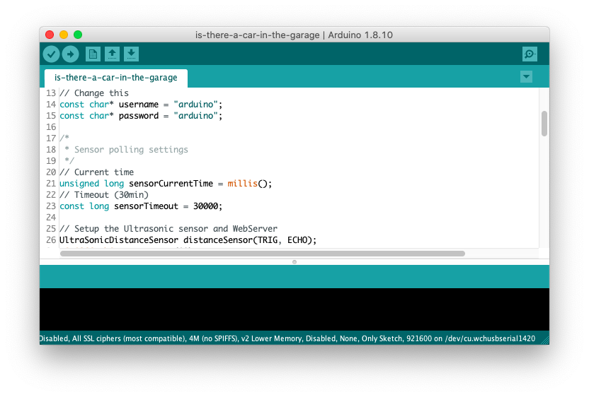
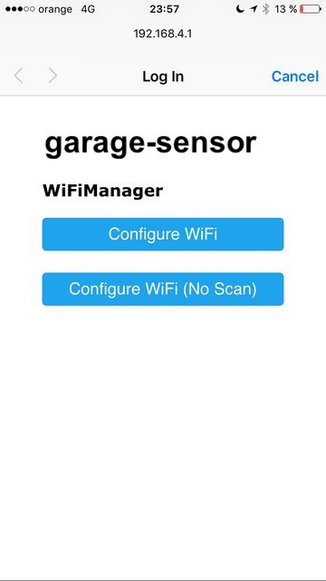
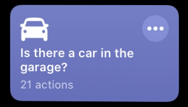
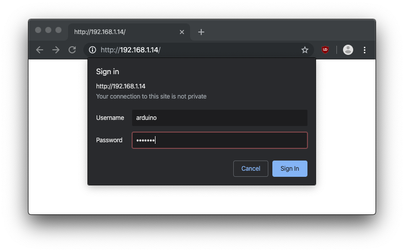
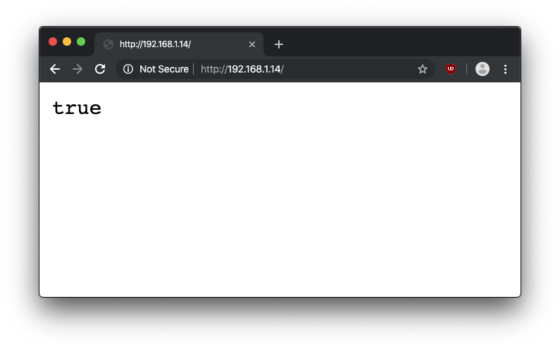

# Is there a car in the garage?
*Is there a car in the garage?* is a small Arduino webserver that uses an ultrasonic sensor to tell if there's a car or not in the garage. It's to be used in conjunction with a Apple Shortcuts or the equivalent in Android.

It is originaly programmed to detect a car in a closed space, but it can be used to detect any static object in a closed space

### [Contact me](https://docs.google.com/forms/d/e/1FAIpQLSduzpEWICbtIJUc46gEXq6bVulhHPPN4JRuc_arat4juTa8eQ/viewform) if you want a kit with everything preinstalled, configured and tested.

### Consider donating if you found this useful:

[](https://www.paypal.me/alvarogalisteo/1.00)

## Prerequisites

This program is tested and used on a [Wemos D1 Mini](https://wiki.wemos.cc/products:d1:d1_mini) board. Even though other boards are not tested, this program should run without problems on boards with a ESP-8266EX chip.

## What's new?

- v1.1:
  - _master_ release: initial release
  - _whitelist-ip_ release: implemented an IP whitelist to bypass authentication for an specific IP
- v1.0: Initial release

## Installation
### Server and sensor

_If you don't want whitelist functionality and for security reasons, we recommend downloading the [master release](https://github.com/SrGMC/is-there-a-car-in-the-garage)._

- Download [is-there-a-car-in-the-garage.ino](https://github.com/SrGMC/is-there-a-car-in-the-garage/raw/whitelist-ip/is-there-a-car-in-the-garage.ino) and open the file in the Arduino IDE.
- Edit the values between `"` for both the username and password in the following lines.  **You shouldn't use the default values as it can be a security issue**

```c
const char* username = "arduino";
const char* password = "arduino";
```

- Edit `int source[4] = {192,168,1,2};` to whitelist an IP of your choice. Requests coming from this IP will bypass authentication. 
    - This is useful when you want to access the sensor from outside your network but want an specific server from your network (i.e. Homebridge server/plugins) to allow retrieving status because it does not support authentication.
- Optional: Uncomment and edit the following line if you want to assign the server a fixed IP Address. This can be useful if you want to access the sensor from the outside world and have the same address everytime it reboots:
    - `IPAddress(192,168,1,14)`: IP Address to assign. In this example, `192.168.1.14`
    - `IPAddress(192,168,1,1)`: IP Address of the gateway (or router)
    - `IPAddress(255,255,255,0)`: Subnet mask

```c
//wifiManager.setSTAStaticIPConfig(IPAddress(192,168,1,14), IPAddress(192,168,1,1), IPAddress(255,255,255,0));
```



- Press compile and verify, and wait for the program to load onto the board.
- Connect pins the following pins on the ultrasonic sensor to corresponding pins in the board:

| Sensor pin | Board pin |
| ---------- | --------- |
| Trig       | D1        |
| Echo       | D2        |
| Vcc        | 5V        |
| Gnd        | G         |


- Power the board up and connect to the wireless network called "garage-sensor". A captive portal should pop up. Use this to set your home's wireless credentials for the Arduino to connect. It should look like this:



- Your server should be fully functioning. If this is the only server that you'll run open to the internet, open port `80` to the Arduino Server IP on your router. If not, use a [reverse proxy](#reverse-proxy) in one of your servers.

### Reverse proxy
#### Nginx
Add the following to your sites-enabled configuration:

```nginx
location /<Path> {
    proxy_pass http://<IP Address>/;
    add_header Cache-Control 'no-store, no-cache, must-revalidate, max-age=0';
    add_header Cache-Control 'post-check=0, pre-check=0';
    add_header Pragma 'no-cache';
}
```

Change `<Path>` and `<IP Address>` accordingly. For example, accessing the server at `172.168.0.13` through the `/home` path:

```nginx
location /home {
    proxy_pass http://172.168.0.13/;
    add_header Cache-Control 'no-store, no-cache, must-revalidate, max-age=0';
    add_header Cache-Control 'post-check=0, pre-check=0';
    add_header Pragma 'no-cache';
}
```

### iOS Shortcut

- Download this [Shortcut](https://www.icloud.com/shortcuts/2c882fd182f14ea6b3fa74673e178815) and fill in all the setup answers.
  - The default username and password is `arduino`. **You shouldn't use the default values as it can be a security issue**
  - You can edit the shortcut and its values by pressing on `(...)`

  

### Android action
TODO

## Usage
### Web
You can access the server through a web browser by navigating to the server's IP Address and introducing your credentials. The web page will show `true` (if there's a car) or `false` (if there isn't a car)




### iOS
On iOS 13, you need to ask Siri the name of the shortcut for it to be run. When the shortcut finishes, Siri will speak to you if there is or not a car. You can change what Siri says with the initial setup questions.

On iOS up to iOS 12, you'll need to setup a Siri Shortcut through the shortcut settings. Then, when the shortcut finishes, Siri will speak to you if there is or not a car.

Alternatively you can run the shortcut by pressing on it on the Shortcut app or Widget and Siri will tell you if there is or not a car.

## Acknowledgements

- [WiFiManager](https://github.com/tzapu/WiFiManager) by [@tzapu](https://github.com/tzapu)
- [HC-SR04](https://github.com/Martinsos/arduino-lib-hc-sr04) by [@Martinsos](https://github.com/Martinsos)
